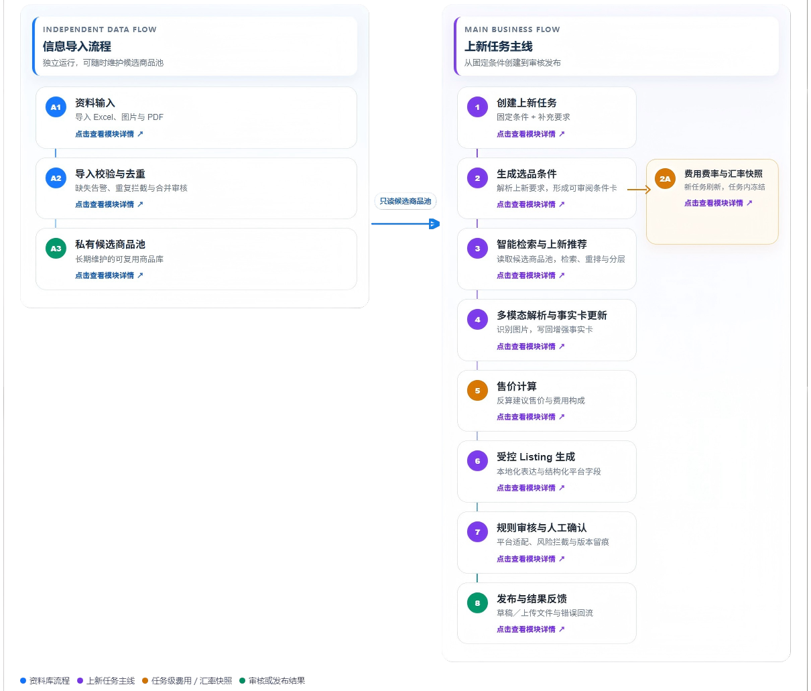
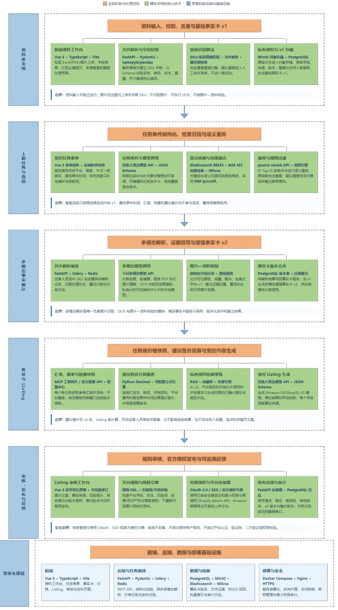

# 棱镜上新 PrismLaunch

## AI 智能上新解决方案项目书

> **参赛场景：** 场景一：AI 智能上新    
> **团队名称：** 三棱  
> **队长信息：** 东南大学-王苏涵-13767987797-1794903733@qq.com

---

<a id="project-overview"></a>

# 1. 项目说明

> **参赛场景：** 场景一：AI 智能上新  
> **方案名称：** 棱镜上新 PrismLaunch
> **项目定位：** 证据驱动的跨境商品上新智能体（以Amazon、Shopify为例）
> **核心主张：** 将国内商品资料转化为有证据、合规则、可审核、可发布的海外平台商品资产。

---

## 1.1 问题分析

我们的项目是**连接国内商品与海外销售网站的一座智能桥梁**，聚焦国内商家将商品上架至海外平台的真实环节。商家从供应商处获得的往往是中文 Excel、商品图片、包装图、规格书和 PDF；最终却需要交付符合 Amazon US 或 Shopify US 要求、可审核、可发布的商品资产。项目要解决的并非“更快写英文”，而是：**输入资料是否可用、哪些商品值得处理、翻译是否准确、生成内容是否可信且能安全发布。**


首先介绍一下关键字段SKU， 它可以简单理解为一个可单独销售的具体商品款，例如“黑色、500ml、不锈钢随行水杯”就是一个 SKU；颜色、容量等规格变化后，通常会形成新的 SKU。 

我们的系统帮助店铺选出更值得上架的 SKU，并将零散中文资料整理为可核验、可本地化、可按平台提交的商品资产。**它不是单纯的上新工具，而是国内商品走向海外市场后续一系列运营动作的起点**。

但是跨境店铺在选品和上新环节普遍面临以下问题：

### 1.1.1 商品资料

**国内商品资料通常比较零散**：有的信息在商品表里，有的在商品图片、包装图或 PDF 规格书里，而且资料不一定完整。比如缺少供货价、币种、包装尺寸、重量、材质、配件清单、商品图片或规格文件中的任何一项，都可能影响后续的海外平台字段填写和发布审核。

### 1.1.2 本地化差异

海外上架时，**不能把中文资料逐句翻译成英文**。例如，中文里的“随行杯”不能直接翻成一个固定英文词。系统需要结合它的杯盖类型、容量、材质和使用场景，判断它更适合被写成 travel tumbler、water bottle，还是其他海外用户更容易理解的商品名称。规格方面，国内资料常用“500ml、20cm、300g”等单位，海外网站的用户更习惯看到“16.9oz、7.9in”等表达。

### 1.1.3 选品失准

店铺运营人员通常会用一句自然语言提出选品需求，例如：“请从国内候选商品中，为美国站饮具类目补一款黑色、约 16oz、材质为不锈钢的随行水杯，单件利润至少为 5 美元。”这句话其实同时包含了很多条件：要上哪个平台、属于什么类目、面向哪个国家、必须具备哪些属性、哪些条件应排除，以及是否与店铺现有商品重复。人工用 Excel 筛选时，往往只能按字面匹配，容易出错：例如同类商品在英文里可能被写成 water bottle、travel tumbler 或 drinkware；国内资料写“500ml”，美国站点更常见的是“16oz”，两者大致对应但表达不同。这样一来，**符合条件的商品可能被漏掉，不合适的商品也可能被选进来**。

而且，“名称看起来相近”并不代表这款商品就值得优先上架。它还可能与店铺已有商品太相似、中文资料不完整，或缺少支撑英文页面与后续建议售价计算所需的图片、规格、成本和证据材料。 

### 1.1.4 平台适配

**不同平台需要填写的内容并不一样**，比如 Amazon US 更关注商品类目、英文标题、属性、五点描述、搜索词、图片和颜色 / 容量等变体信息；Shopify US 除了商品标题和详情，还需要整理 SEO、商品集合、标签、FAQ、图片和自定义字段等内容。

如果运营人员靠人工在平台之间反复复制、修改，就容易出现**效率低、内容重复、一个地方改了另一个地方忘记改**的问题。很多图片不符合要求、字段漏填、变体关系错误或文案不合规的问题，也常常要等提交到后台后才发现，导致返工。

### 1.1.5 信息冲突

同一款商品的资料有时会“对不上”。例如，商品表里写着“不锈钢”，但图片或说明书没有明确说明具体材质；包装清单写有两个配件，商品图里却只看到一个。还有一种常见情况是，包装图上写着“防漏”等宣传语，但这并不代表已经有足够资料证明它真的可以作为英文性能卖点发布。

如果直接相信其中一份资料，或者让 AI 根据不完整信息自行补充，就可能**把不确定、甚至错误的内容写进海外商品页面**。

### 1.1.6 合规风险

跨境上架还面临禁限售、夸大宣传、第三方品牌或 Logo、授权材料缺失、品牌字段缺失及产品安全说明不完整等风险。**高风险的功效、认证、安全和绝对化表述必须有证据与人工确认**；发现第三方品牌、授权材料缺失或平台关键字段缺失时，系统会提示处理路径或阻断相关发布包。

---

## 1.2 方案概述

### 1.2.1 目标用户

目标用户是需要将国内商品上架到海外平台的国内品牌方、工贸商家及跨境运营团队，尤其适合商品资料主要以中文 Excel、图片、包装图和规格 PDF 交付、但没有专职数据整理团队的商家。系统服务的不是单一岗位，而是围绕同一 SKU 协作的三类角色：

- **品牌方／工贸商家与供应链人员：** 负责提供商品表、图片、规格和成本资料，但资料通常分散在不同人员和不同版本文件中。他们需要明确知道每个 SKU 缺什么、由谁补、补完后是否能再次被使用，而不是反复接受运营人员的临时追问。
- **跨境选品与 Listing 运营人员：** 需要根据平台、站点、店铺现有目录和上新目标，从大量国内商品中挑选合适 SKU，并完成英文页面。他们需要的是能理解本次任务、说明为什么推荐、同时提示资料风险的工作台，而不是只按关键词匹配的一张商品表。
- **审核与店铺负责人：** 需要在发布前确认商品类目、图片、变体、平台字段和敏感表述，避免重复发布、错误资料、未经证实的功效宣传或品牌／知识产权风险。他们需要能回看每一项内容来源、修改记录和拦截原因的审核依据。

### 1.2.2 方案解决的问题

国内商品“有资料但难上架”的根本原因，不是缺少一段英文文案，而是供应商资料还没有变成**可识别、可核验、可按平台提交的商品资产**：同一商品的名称、规格、图片和包装信息散落在不同文件中；有些信息缺失，有些信息彼此矛盾；运营人员即使选中了商品，也无法确定哪些事实可以安全写入海外页面。

我们的系统围绕这条从“国内资料”到“海外发布”的链路，重点解决以下五类问题：

1. **资料无法直接使用。** 商品名称、商品类目等资料可能为空、格式不规范，或无法关联到对应 SKU。系统会在导入商品资料时，自动识别并填写能确认的信息。如果有必填字段没有填写，系统会立即提示告警。此时用户需要补齐资料，才能保存并进入下一步操作。
2. **重复商品和零散文件反复消耗人力。** 同一商品可能在多张表中重复出现，甚至已经存在于商家海外店铺目录。系统会识别重复：完全重复记录不入库，疑似重复先进入人工合并审核，使后续检索、生成和发布面对的是干净的商品库。
3. **选品要求是动态的，人工筛选难以复用。** 运营人员提出的是自然语言任务，而不是固定的筛选表。我们的设计是用户可以用两种方式提出选品需求：一是直接填写价格、目标平台、商品品类等必填条件；二是像平时沟通一样，用一句话描述需求。系统会先理解用户的需求，并把它整理成明确的筛选条件。然后结合关键词搜索、语义理解和规则筛选，从国内候选商品中找出更适合本次上新任务的商品。并说明推荐原因、待补充资料和下一步动作。
4. **本地化不能停留在逐句翻译。** 国内商品名称、容量尺寸单位、使用场景、配件说明与海外用户表达、Amazon US／Shopify US 字段并不一一对应。系统在保留中文原始值和证据来源的前提下，完成术语对齐、单位换算、海外表达和平台字段映射，避免把中文习惯、生硬直译或不适用的卖点直接带到海外页面。
5. **生成内容缺乏事实边界，发布风险后置。** 图片和文字信息可能发生冲突，不能相互印证；功效、认证、安全和绝对化表述又常缺乏可靠依据。系统在多模态事实确认完成后，基于增强商品事实卡核对图片与同一 SKU 商品资料的一致性，只有“已确认可写”的事实与“已确认可用”的图片才能进入 Listing。

因此，我们以“商品事实卡”为可信底座：商品资料输入是独立的资料库维护流程，持续输入、校验并去重，形成可复用候选池；创建上新任务、生成任务规则、智能检索与推荐则构成业务主线。 **它把原来分散在供应商、运营和审核人员之间的反复确认，转成有状态、有证据、可追溯的协作流程。** 

### 1.2.3 核心功能

1. **资料输入与导入校验：** 接收 Excel、图片、PDF，按 SKU 归集资料，校验字段。缺少关键字段不可进行资料保存；
2. **重复识别与候选池管理：** 拦截完全重复记录，提示疑似重复商品合并，保持候选池干净；
3. **智能选品：** 用户可填写价格、平台、品类等条件，系统按规则筛选商品；也可直接输入一句需求，系统自动理解并筛选、排序，最后给出优先推荐、观察或暂缓的商品结果；
4. **事实核验与 Listing 生成：** 在多模态增强商品事实卡中，系统核对商品图片与商品资料是否一致，并标明每条信息的来源、可信程度、是否有冲突和审核状态。只有确认无误的信息，才能用于生成英文商品内容；
5. **规则审核与发布：** 检查 Listing 的字段、变体、图片引用、风险词和资料边界；输出 Shopify 草稿或 Amazon 上传文件。

### 1.2.4 方案亮点及预期效果

- **资料实时录入：** 资料输入是独立的资料库维护流程，可在任何时间运行；
- **任务动态理解：** 由大语言模型将自然语言上新要求整理为可审阅的选品条件；
- **任务级售价计算：** 每次新建上新任务均冻结当次汇率、平台费用、物流模板和税费口径；在商品事实确认后，按最低单件利润反算可编辑建议售价。；
- **证据驱动生成：** 术语、单位、场景表达和平台字段都有原始资料与处理记录；
- **人机协同可落地：** 模型负责理解、检索、整理和生成，规则负责拦截，运营人员处理边界内容；
- **分钟级完成：** 在资料齐备的情况下，将人工反复整理与首版 Listing 产出压缩至分钟级，并降低事实错误、重复发布和无证据宣称风险。

---

## 1.3 核心功能

<a id="business-flow"></a>

### 业务流程图



*图 1　业务流程图*

### 1.3.1 资料输入与导入校验

系统可以接收 Excel / CSV、商品白底图、包装图、细节图、规格书和 PDF 等资料。导入后，系统会**自动识别 SKU、商品字段、文件之间的关联和格式问题**，并先生成一份待检查的商品资料。系统会检查关键字段是否齐全。

如果**必填信息或关键资料缺失、填写错误，或无法确认属于同一商品**，系统会立即提示缺少哪一项。资料没有补齐前，用户**不能保存并进入下一步**。

### 1.3.2 重复识别与候选池管理

系统以 SKU、条码、原始文件哈希、标题与关键属性组合识别重复。完全重复的行或文件仅保留导入日志，不进入候选商品库；与既有记录疑似相同但资料不一致的商品进入合并审核队列。只有**通过导入校验、完成去重处理的商品摘要才进入私有候选商品池**，供后续检索使用。

### 1.3.3 智能选品

我们为用户设计了**两种提出选品需求的方式**：

第一种是**必填方式**。用户需要填写价格、目标平台、商品品类等基础条件。系统会根据这些明确条件筛选和排序商品。

第二种是**可选方式**。用户可以像日常沟通一样，用自然语言补充需求，例如“找一款黑色不锈钢随行水杯”。大语言模型会读取这段需求，生成一张可查看、可修改的选品条件卡。

开始推荐后，系统会同时使用关键词搜索和语义搜索，从国内候选商品池中找出相关商品。系统再对结果进行融合和排序，并结合是否符合价格和属性要求、是否与已有商品重复等规则，将商品分为优先推荐、继续观察、暂缓上架等结果。

大语言模型主要负责解释结果，例如说明：**为什么推荐这款商品、它还缺什么资料、下一步需要做什么。** 它不会自行决定商品事实，也不会绕过筛选规则。

### 1.3.4 事实核验

文档解析将已输入资料转为属性候选，并为每个属性绑定来源文件、页码／单元格／图片区域、原始值、标准化值、置信度和审核状态。**系统将主图、包装图中的颜色、款式、可见配件、容量标识和文字，与同一 SKU 的商品表、规格 PDF 逐项交叉核对；不一致时在商品事实卡中标记冲突并要求人工确认。** 图片无法单独证明的材质真实性、供货价、保温时长、认证或安全性，仍必须以商品表、规格书或授权／检测资料为证据。多个来源冲突时，系统保留全部证据并转入人工确认，不自动选择一个答案。

### 1.3.5 Listing 生成

受控生成模块只检索当前 SKU 已确认、允许上架的商品事实和对应平台规则。它为 Amazon US 输出标题、五点、描述、搜索词及结构化字段，为 Shopify US 输出商品标题、详情页、SEO、标签和 Metafields；每一条卖点都需要关联事实证据，未确认的配件、认证、功效与安全声明不得写入。

### 1.3.6 规则审核与发布反馈

系统会检查标题、描述、属性、图片、变体和必填字段**是否符合国外平台的格式要求**；同时**检查草稿中是否出现未经授权的第三方品牌名称、Logo、图片或其他可能涉及侵权的内容**，以及**品牌相关字段、授权材料是否完整**。

如果发现格式问题或授权法律风险，系统会明确提示修改项，并暂缓发布。审核通过后，系统可以创建 Shopify 商品草稿，或导出 Amazon 上传文件。平台返回的报错、修改记录、发布版本和审核结果都会保存下来，方便后续追溯和再次修改。

---

## 1.4 技术方案

<a id="technical-roadmap"></a>

### 技术路线图



*图 2　技术路线图*

### 1.4.1 总体架构

```text
资料输入支线：
资料输入（Excel / 图片 / PDF）
        ↓
导入校验与重复识别（字段完整度 / SKU 与文件关联 / 重复拦截）
        ↓
可用候选商品池

业务主线：
创建上新任务（任务文本 / 平台站点）
        ↓
任务拆解（条件规则约束 / 大语言模型识别）
        ↓                         ↓ 
智能检索与上新推荐            费用费率与汇率快照
        ↓                        ↙
多模态解析（表格解析 + OCR + 视觉理解）
        ↓
商品事实库（属性 + 证据 + 置信度）
        ↓
售价计算（任务级冻结汇率 / 费用版本 / 税费预估 / 建议售价）
        ↓
受控生成（大语言模型 + 私有资料检索 + 结构化输出）
        ↓
平台规则引擎 → 审核工作台
        ↓
Shopify 草稿 / Amazon 上传文件 / 结果反馈
```

### 1.4.2 数据与模型边界

原始 Excel、图片、PDF、完整海外店铺目录均保留在私有数据区；调用云端 API 时只发送当前任务必要的条件卡、候选摘要、已确认事实和规则片段。模型不修改商品主数据、不清除导入告警、不把疑似重复记录直接写入商品库，也不能直接写入平台后台。所有模型输出均受 JSON Schema 约束。

### 1.4.3 MVP 可运行范围

1. 分别演示两条独立支线：导入 10 个候选 SKU 的商品表、图片／PDF、海外自有目录；创建一条基于规则，自然语言作为补充的上新任务；
2. 在导入页立即展示商品名称、商品类目、供货价、物流资料等字段缺失告警和重复识别结果，缺失与重复不进入候选商品库；
3. 展示任务规则 JSON、检索、重排与推荐原因；
4. 选择一个候选 SKU，生成商品事实卡，展示原始值、本地化单位、证据定位和冲突；
5. 在商品事实确认后，展示基于任务冻结汇率、费用版本和最低单件利润得到的可编辑建议售价；
6. 生成 Amazon US 与 Shopify US 草稿；
7. 拦截无依据的保温、防漏、认证等表达；
8. 创建 Shopify 草稿或导出 Amazon 上传文件，展示结果回流。

### 1.4.4 效果验证

- 系统自动解析用户输入的文件；
- 完全重复以及缺失关键字段的记录不进入候选商品库；
- 10 个导入 SKU 可在导入完成后进入可用候选池；
- 10 个候选 SKU 可形成可解释的排序结果；
- 5—10 个 SKU 的关键属性可自动结构化并定位来源；
- 高风险无证据宣称不得进入发布输出；
- 资料齐备时，首版 Listing 草稿进入分钟级流程。

---

<a id="feature-examples"></a>

<a id="input-example"></a>

# 2. 关键功能

## 2.1 资料输入与自动整理

### 2.1.1 输入及整理流程

运营人员可随时导入国内商品表、主图、包装图和规格 PDF。系统把同一商品的多份资料关联起来，自动预填可识别信息、提示缺失信息、拦截重复记录，并将合格商品写入私有候选商品池。

```text
            用户上传国内商品资料
                    ↓
             自动解析文件内容
                    ↓
           校验基础信息与关键字段
                    ↓
        是否存在缺失、错误或无法关联的资料？
                 ┌─────────────┐
                 是            │
                 ↓             │
      生成缺失字段提示          否
                 ↓             │
      用户补充或修正资料         │
                 ↓             │
        重新解析并校验          │
                 │  ───────────┘
                 ↓
          允许保存商品资料
                 ↓
     进入候选商品池与下一步选品流程
```

### 2.1.2 自动预填、缺失告警与去重结果示例

| 导入记录 | 系统自动整理结果 | 当前状态 | 去重结果 | 后续处理 |
|---|---|---|---|---|
| `LM-KT-BTL-001-BLK-500` | 从 Excel 读取名称、类目、成本；从 PDF 读取重量、尺寸；从包装图识别容量 | `search_ready` | 新商品 | 写入候选商品池 |
| `LM-KT-BTL-002-BLK-500` | 关键字段缺失。例如已读取名称、类目、容量和供货价；未识别原产国、包装尺寸 | `needs_completion` | 新商品 | 提示补充 |
| `IMPORT-ROW-003` | 无法可靠识别商品名称与商品大类 | `draft_blocked` | 无法识别商品 | 保留为待补全资料草稿，不进入检索索引 |
| `LM-KT-BTL-001-BLK-500-copy` | SKU、主图哈希和关键属性与 SKU-001 一致 | `duplicate` | **完全重复** | 仅保留导入日志，不写入候选商品池 |
| `LM-KT-BTL-004-BLK-500` | 标题、主图和关键属性高度相似，但包装资料不同 | `possible_duplicate` | 疑似重复 | 进入合并审核，审核前不参与检索 |

**字段来源与待补提示示例：**

```json
{
  "sku": "LM-KT-BTL-002-BLK-500",
  "data_quality_status": "needs_completion",
  "field_values": [
    {"item": "中文商品名称", "value": "黑色不锈钢随行水瓶", "source": "supplier.xlsx:第12行", "status": "confirmed"},
    {"item": "容量", "value": "500ml", "source": "package.jpg:OCR", "status": "needs_confirmation"},
    {"item": "供货单价", "value": "28 CNY", "source": "supplier.xlsx:第12行", "status": "confirmed"},
    {"item": "原产国", "value": null, "source": null, "status": "required"},
    {"item": "包装尺寸", "value": null, "source": null, "status": "required"}
  ],
  "ui_prompt": "商品信息需补齐带 * 的字段。"
}
```

系统将抽取值与来源一起展示。置信度不足时，字段显示为候选值，运营人员可确认或修改。

### 2.1.3 去重与候选商品池边界

1. **完全重复**：SKU／条码、主图哈希和关键属性组合一致时，记录仅保留在导入日志中，不写入候选商品池，不参与检索、生成或发布。
2. **疑似重复**：标题、图片或核心属性高度相似但资料不完全一致时，创建合并审核任务；审核完成前不进入检索索引。
3. **原始资料可追溯**：候选商品池只保存商品摘要、资料状态、原始文件索引和版本；后续事实核对必须回读原始表格、图片和文档。

---

<a id="selection-example"></a>

## 2.2 创建上新任务

### 2.2.1 任务表单

```text
目标平台 *          [ Amazon US ▾ ]
目标国家 *          [ 美国 United States ▾ ]
中文一级商品大类 *  [ 家居与厨房 ▾ ]
最低单件利润 *      [ ≥ 5 ▾ ] [ USD ▾ ]

其他补充要求（选填）
[ 黑色、简约通勤风、约 16oz 的随行杯；
  不要吸管款；优先配件资料明确的商品。 ]
```

| 固定条件 | 作用 |
|---|---|
| 目标平台 | 确定平台规则、费用配置和后续 Listing 结构 |
| 目标国家 | 确定展示币种、目的地物流模板和税费估算范围 |
| 中文一级商品大类 | 对候选商品池进行清晰、可控的硬筛选 |
| 最低单件利润（≥ 金额）+ 币种 | 作为后续建议售价计算的任务参数 |
| 其他补充要求 | 由大语言模型提取细分类型、容量、颜色、风格、使用场景与排除条件；不得覆盖固定条件 |

固定条件优先于自然语言。例如选择“家居与厨房”而补充文本写“女式连衣裙”时，系统返回条件冲突并要求修改任务，不擅自扩大搜索范围。

### 2.2.2 任务理解与选品条件卡

| 项目 | 内容 |
|---|---|
| 大语言模型身份 | 把运营人员可读的上新要求转成稳定、可审阅的检索约束 |
| 输入 | 固定表单条件、其他补充要求、候选商品池可检索字段说明 |
| 输出 | 选品条件卡：固定硬条件、必须条件、偏好条件、排除条件与推荐解释要求 |
| 下游 | 交给检索、重排模型和规则引擎；审核工作台可查看、编辑并留下版本记录 |
| 边界 | 不修改候选商品资料；不让完全重复或待合并商品进入推荐；不编造商品事实 |

```json
{
  "selection_condition_card": {
    "task_id": "PL-20260826-001",
    "fixed_conditions": {
      "platform": "Amazon US",
      "destination_country": "US",
      "top_level_category_zh": "家居与厨房"
    },
    "must_have": ["黑色", "适合随行使用"],
    "preferences": ["约 16oz", "简约通勤风格", "配件资料明确"],
    "exclusions": ["吸管款", "完全重复商品", "疑似重复待合并商品"],
    "explanation_required": true
  },
  "handoff_to": ["retrieval_and_reranking", "rule_engine", "review_workbench"]
}
```

### 2.2.3 费用费率与汇率快照

在选品条件卡生成后，系统以任务编号、目标平台、目标国家和最低单件利润为索引，创建一份只属于本任务的测算快照。

| 输入 | 输出 |
|---|---|
| 任务编号、目标平台、目标国家、最低单件利润及币种 | 本任务参考汇率快照；平台费用与履约费用配置版本；税费计算口径版本；测算版本号 |

- **新建任务时刷新**：每创建一个新的上新任务，系统重新拉取最新可用参考汇率。
- **任务内冻结**：同一任务的所有建议售价测算均使用同一份汇率快照，记录币种对、数值、来源、生效日期、抓取时间和任务编号。
- **费率按版本读取**：平台销售费、履约费、物流模板等由后台受控配置读取；税费口径作为版本化规则传给后续测算。
- **不把税费说成固定事实**：进口关税的最终估算仍依赖商品事实卡中的用途、材质、原产国、申报价值和自动推算的税则候选信息。

```json
{
  "pricing_snapshot": {
    "task_id": "PL-20260826-001",
    "reference_exchange_rate": {
      "pair": "CNY/USD",
      "rate": 0.139,
      "source": "approved_exchange_rate_service",
      "reference_date": "2026-08-26",
      "fetched_at": "2026-08-26T10:10:00+08:00",
      "scope": "frozen_for_this_task"
    },
    "fee_configuration_version": "amazon-us-fba-v2026-08",
    "tax_calculation_policy_version": "us-import-estimate-v1",
    "handoff_to": "pricing_calculation"
  }
}
```
## 2.3 智能搜索与选品推荐

### 2.3.1 检索与排序路径

```text
路径一：用户填写必填条件
                ↓
          条件约束规则
                ↓
                ├──────────────┐
                │              │
路径二：可选自然语言上新需求     │
                ↓              │
大语言模型识别需求              │
                ↓              │
          选品条件卡            │
                ↓              ↓
                └──────→ 合并为统一选品条件
（用户必填条件优先，作为硬条件；自然语言识别结果只作为补充）
                              ↓
                  硬条件预过滤 + 重复商品拦截
                              ↓
               BM25 关键词检索 + Embedding 语义检索
                              ↓
                           结果融合
                              ↓
                       Reranker 重排模型
                              ↓
                         规则引擎校验
                              ↓
                 优先推荐 / 继续观察 / 暂缓上架
                              ↓
                       大语言模型输出解释
```

### 2.3.2 推荐结果示例

| 推荐顺位 | SKU | 商品摘要 | 与任务的匹配点 | 推荐理由 |
|---|---|---|---|---|
| 1 | `LM-KT-BTL-001-BLK-500` | 黑色不锈钢随行水瓶，500ml | 黑色、随行使用、不锈钢材质 | 同时满足平台、国家、一级类目和“无吸管款”等硬条件；与“简约通勤风、约 16oz”的补充要求最接近。 |
| 2 | `LM-KT-BTL-006-BLK-470` | 黑色双层保温水瓶，470ml | 黑色、随行使用、保温结构 | 满足固定条件和核心使用场景；容量略小于偏好值，但整体风格和材质语义匹配度较高。 |
| 3 | `LM-KT-MUG-012-BLK-480` | 黑色不锈钢带盖随行杯，480ml | 黑色、通勤、无吸管设计 | 满足固定条件及排除项；杯型与水瓶存在差异，因此排在前两项之后。 |

---

<a id="fact-card-example"></a>

## 2.4 多模态解析与事实卡更新

### 2.4.1 两种商品事实卡

商品事实卡分为两个版本，分别服务于资料库支线和上新任务主线：

```text
资料输入、保存校验、去重完成
        ↓
基础商品事实卡（v1）
        ↓
私有候选商品池 → 智能检索与推荐
        ↓
多模态解析模块识别图片、提取视觉／文档信息
        ↓
将结构化结果写回并更新为多模态增强商品事实卡（v2）
        ↓
售价计算、受控 Listing 生成、规则审核
```

| 类型 | 产生时点 | 内容 | 作用 |
|---|---|---|---|
| **基础商品事实卡（v1）** | 资料输入完成保存校验、通过去重后 | 商品表和已确认资料中的基础字段、原始文件引用、来源位置、保存状态 | 写入候选商品池，支持检索与推荐，并为后续多模态解析提供结构化底稿 |
| **多模态增强商品事实卡（v2）** | 商品被推荐并由运营人员选中后 | v1 内容 + 多模态解析模块返回的图片／包装／PDF 结构化结果、证据引用、可用图片状态与本地化表达 | 为售价计算、Listing 生成和最终审核提供当前任务可用的事实包 |

### 2.4.2 基础商品事实卡（v1）

基础商品事实卡在资料输入阶段创建。商品只有通过必要字段校验并且不是重复记录，才能保存为 v1 并进入候选商品池。

| 项目 | 示例值 | 来源 | v1 可用范围 |
|---|---|---|---|
| 商品 SKU | `LM-KT-BTL-001-BLK-500` | `supplier.xlsx!A2` | 唯一关联、检索与版本追溯 |
| 中文商品名称 | 黑色不锈钢随行水瓶 500ml | `supplier.xlsx!B2` | 检索摘要、本地化底稿 |
| 中文一级商品大类 | 家居与厨房 | `supplier.xlsx!C2` | 选品硬筛选、平台类目映射 |
| 供货单价及币种 | 28 CNY／件 | `supplier.xlsx!J2` | 建议售价计算；经商家授权后可作为价格优势表达依据 |
| 原产国 | 中国 | `supplier.xlsx!M2` | 税费计算、平台原产地字段、产地表达 |
| 单件申报价值及币种 | 8 USD／件 | `supplier.xlsx!N2` | 税费计算；经商家授权且平台允许时可作价值说明 |
| 包装后重量 | 0.42 kg | `specification.pdf!P3` | 物流测算、轻便携带表达依据 |
| 包装尺寸 | 7.1 × 7.1 × 26.4 cm | `specification.pdf!P3` | 物流测算、规格和紧凑表达依据 |
| 商品用途 | 通勤、办公室、校园、短途出行 | `supplier.xlsx!K2` | 场景匹配、详情页表达依据 |
| 主要材质 | 不锈钢 | `supplier.xlsx!F2` | 检索、平台字段和材质表达 |
| 原始资源引用 | `front.jpg`、`package.jpg`、`specification.pdf` | 导入批次 | 供多模态解析模块读取；v1 不包含图片识别结论 |

#### v1 JSON 示例

```json
{
  "basic_fact_card": {
    "fact_card_id": "FC-LM-KT-BTL-001-v1",
    "sku": "LM-KT-BTL-001-BLK-500",
    "version": "v1",
    "status": "saved_and_verified",
    "deduplication": "unique",
    "base_facts": [
      {"name": "product_name", "value": "黑色不锈钢随行水瓶 500ml", "source": "supplier.xlsx!B2"},
      {"name": "supply_cost", "value": "28 CNY / unit", "source": "supplier.xlsx!J2"},
      {"name": "country_of_origin", "value": "中国", "source": "supplier.xlsx!M2"},
      {"name": "package_dimensions", "value": "7.1 × 7.1 × 26.4 cm", "source": "specification.pdf!P3"}
    ],
    "asset_references": ["front.jpg", "package.jpg", "specification.pdf"],
    "handoff_to": ["candidate_pool", "multimodal_analysis"]
  }
}
```

### 2.4.3 多模态增强商品事实卡（v2）

在运营人员从推荐结果中选择商品后，多模态解析模块读取 v1 的原始资源引用，并执行图片识别、图片文字提取、包装／规格文档解析和图片—资料核验。它将**结构化输出**交给事实卡服务；事实卡服务以版本化方式更新为 v2。

| 来自多模态解析模块的更新项 | 示例结果 | 证据引用 | 在 v2 中的用途 |
|---|---|---|---|
| 商品款式与颜色 | 黑色直筒水瓶 | 多模态结果 `MM-002` | 标题、卖点、图片说明、变体表达 |
| 图片中的容量标识 | `500 ml` | 多模态结果 `MM-001` | 与 v1 容量字段共同支持规格表达 |
| 杯盖配件 | 密封杯盖 | 多模态结果 `MM-003` | 卖点、详情、规格字段 |
| 包装可见文字 | `500 ml`、材质相关标识 | 多模态结果 `MM-004` | 作为附加证据引用，不替代 v1 已确认字段 |
| 图片资源可用状态 | 主图、细节图可用 | 多模态结果 `MM-005` | Listing 图片选择与审核引用 |
| 本地化单位表达 | `500 ml / 16.9 fl oz`、`0.93 lb` | 单位换算规则 + v1／多模态证据 | 标题、详情与规格字段 |

#### v2 更新规则

1. v2 **继承 v1** 的基础事实、原始来源和保存校验状态，不覆盖或删除 v1；
2. 多模态模块只返回其识别出的结构化结果、置信度、资源标识和证据引用；
3. 事实卡服务把这些结果追加为“多模态增强字段”，形成可追溯的 v2；
4. 商品事实卡不自行读取图片像素、不做 OCR、不判断图片内容；
5. Listing 生成仅读取 v2 中已确认、且允许当前平台使用的事实和图片资源引用。

#### v2 JSON 示例

```json
{
  "enhanced_fact_card": {
    "fact_card_id": "FC-LM-KT-BTL-001-v2",
    "base_fact_card_id": "FC-LM-KT-BTL-001-v1",
    "sku": "LM-KT-BTL-001-BLK-500",
    "version": "v2",
    "update_source": "multimodal_analysis",
    "multimodal_updates": [
      {"name": "visual_style_and_color", "value": "black straight-sided water bottle", "result_id": "MM-002", "listing_allowed": true},
      {"name": "visible_capacity_label", "value": "500 ml", "result_id": "MM-001", "listing_allowed": true},
      {"name": "lid_accessory", "value": "sealed lid", "result_id": "MM-003", "listing_allowed": true},
      {"name": "listing_image_assets", "value": ["front.jpg", "detail.jpg"], "result_id": "MM-005", "listing_allowed": true}
    ],
    "handoff_to": ["pricing_calculation", "controlled_listing_generation", "platform_review"]
  }
}
```

### 2.4.4 交付信息

#### 售价计算

售价计算模块读取 v2 中继承的基础资料与可用的多模态增强结果，再结合当前任务的费用费率与汇率快照，反算建议售价。

| 交付项目 | 主要来源 | 对售价计算的作用 |
|---|---|---|
| 供货单价及币种 | v1 基础事实 | 按任务冻结汇率换算成本 |
| 用途、主要材质 | v1 基础事实；必要时引用 v2 增强证据 | 支持自动推算税则候选 |
| 原产国、申报价值 | v1 基础事实 | 支持进口关税预估 |
| 包装重量、尺寸 | v1 基础事实 | 支持物流与履约费用测算 |
| 图片／包装可见规格 | v2 多模态增强字段 | 为已确认规格补充证据引用，不单独决定税费或成本 |
| 美国 HTSUS 候选编码 | 售价计算调用归类规则推算 | 只用于税费预估，不形成自动报关结论 |

- 任务级冻结汇率、平台费用版本和税费计算口径由费用快照服务提供；
- 售价计算模块不修改 v1／v2 商品事实卡，也不识别图片；
- 若后台费率或汇率快照不可用，则暂停测算并保留异常记录，不要求商品事实卡重新识别图片或补齐已通过保存校验的商品资料。

#### Listing生成

v2 是当前任务中生成 Listing 的事实来源。尺寸、重量、成本、原产国和申报价值均可作为 Listing 信息或卖点依据，但需要区分其公开方式。

| 内容类型 | 系统处理 | 展示边界 |
|---|---|---|
| 商品名称、颜色、容量、材质、已确认配件 | 可直接交给 Listing 生成 | 只能忠实本地化，不得增加未确认功能或性能 |
| 尺寸、重量 | 可作为规格信息，也可作为“紧凑”“便于携带”等卖点依据 | 保留准确数值和单位；不得夸大或作无依据的竞品比较 |
| 原产国 | 可写入平台原产地字段、详情页或商家确认的产地相关卖点 | 必须使用 v1 已确认原产国；不得将产地推导为品质、认证或合规承诺 |
| 供货成本 | 可作为建议售价和“价格优势／透明供应链”表达的依据 | 默认不直接公开供应商成本；只有商家明确授权并确认展示文案后，才可呈现相关价格优势信息 |
| 申报价值 | 可用于申报字段、建议售价和商家确认的价值说明 | 默认不直接作为普通营销文案；只有商家明确授权且平台允许时，才可展示具体数值或价值说明 |
| 多模态图片识别结果 | 可作为对应图片资源的展示依据和辅助证据 | 只使用结果中已确认并标记可用的图片；不得由事实卡或文案模型重新猜测图片内容 |
| 性能、认证、安全或绝对化表述 | 不自动生成；只有原始资料提供明确可写依据时才允许使用 | 不得凭图片、常识或商品类别推断 |
| 未出现于 v1 或 v2 确认结果中的功能、配件、适用人群或使用效果 | 不生成 | 大语言模型不得猜测补充 |

> 所有面向用户的展示都遵守三重边界：**事实已确认、商家授权、平台允许**。

### 2.4.5 发布边界

- 商品事实卡 v1 为候选商品池提供已保存的基础事实；v2 为当前上新任务提供经多模态处理后可用的增强事实；
- 多模态解析模块是唯一负责图片识别、文字提取和图片—资料核验的模块；它的结构化输出会**更新商品事实卡**，形成 v2；
- 受控 Listing 生成只读取 v2 中允许使用的事实和图片资源引用；
- 最终 Listing 审核只检查草稿是否忠实引用 v2 事实、是否满足平台规则和商家授权范围；

---

<a id="pricing-example"></a>

## 2.5 售价计算

### 2.5.1 模块定位

售价计算需要回答“在本次任务的费用与汇率口径下，为达到运营人员设定的最低单件利润，Listing 可以展示怎样的建议售价”。

- 用户填写“最低单件利润 ≥ 金额 + 币种”。
- 建议售价写入 Listing 草稿的价格位置，运营人员可以修改、确认或暂不使用。
- 建议售价不是最终成交价、结算净利润、报关价格、税务或法律意见。

```text
已确认商品事实卡 + 本任务最低单件利润 + 费用费率与汇率快照
                              ↓
                     售价计算模块
                              ↓
建议售价 + 费用构成 + 缺失字段 + 测算版本
                              ↓
                   受控 Listing 生成
```

### 2.5.2 信息获取

#### 税率冻结

每次创建新的上新任务，系统重新获取一次最新可用参考汇率，并创建与任务编号绑定的费用快照；同一任务中的所有售价测算都使用同一份快照。快照至少记录：币种对、汇率值、数据来源、生效日期、抓取时间、平台费用配置版本、物流／履约模板版本、税费计算口径版本和任务编号。

这样可以避免同一批 Listing 因汇率波动出现口径不一致；当运营人员创建新任务时，系统不复用旧任务汇率，而是重新拉取并冻结新的参考值。

#### 税费处理

- **平台销售费、履约费、物流模板等**：按目标平台、服务类型和配置版本从后台受控读取。
- **汇率换算**：只使用任务快照中的参考汇率。外部数据工具的返回结果要被记录为快照，后续重复计算不再次随机请求汇率。
- **进口关税**：不能在创建任务时简单写成一个对所有商品通用的固定税率。系统在事实卡确认用途、材质、原产国、申报价值等归类要素后，自动推算 HTSUS 候选编码与置信度，再按税费口径版本进行预估。

> MCP 可以作为访问汇率、税费或物流工具的受控接口封装，但 MCP 只是工具调用协议；汇率与税费数据的来源、快照与版本仍要单独记录。

### 2.5.3 输入、输出与边界

| 类别 | 内容 |
|---|---|
| 输入：任务参数 | 任务编号、目标平台、目标国家、最低单件利润及币种 |
| 输入：任务快照 | 冻结汇率、平台费用配置版本、履约／物流模板版本、税费计算口径版本 |
| 输入：商品事实 | 已确认的供货单价及币种、申报价值及币种、原产国、用途、主要材质、包装后重量、包装长宽高、事实卡版本、税则候选 |
| 输出 | 建议售价、目标展示币种、费用构成、计算状态、缺失字段、税费预估依据、测算版本和可追溯输入版本 |

### 2.5.4 计算逻辑

本次采用“满足最低单件利润”的反算方式。对于按售价收取比例费用的平台，基本计算口径为：

```text
建议售价
=（换汇后的供货成本
 + 头程／跨境物流分摊
 + 进口关税预估及已配置清关成本
 + 平台履约费用
 + 平台固定费用
 + 用户输入的最低单件利润）
 ÷（1 - 平台按售价计取的销售费率）
```

其中：

1. **换汇后的供货成本**：以任务冻结汇率，将供应商供货单价统一换算到目标展示币种。
2. **物流与履约费用**：根据目标平台、目的地、包装重量、尺寸及后台版本化运费／履约模板计算或估算。
3. **进口关税预估**：基于商品事实、自动推算的税则候选、原产国、申报价值和税费口径版本计算；信息不全时不强行估算。
4. **平台按售价计取的费用**：如存在按售价比例、最低收费、类目费率或价格阶梯，使用对应配置版本进行迭代试算，而不只套用单一比例公式。
5. **最低单件利润**：由运营人员在任务创建时输入，是售价下限约束，不是选品排序权重。

MVP 不纳入支付／交易手续费、广告费、售后退款、仓储长期费等难以稳定估算或无法从当前商品资料可靠得到的成本项。

### 2.5.5 缺失资料与异常处理

| 情况 | 售价计算结果 | 页面反馈 |
|---|---|---|
| 商品事实、快照与计算资料齐全 | 输出建议售价与费用构成 | 标注测算版本与“待运营确认” |
| 税则候选置信度低或事实冲突 | 不输出可靠税费预估 | 标记“需要补充归类资料”，不把不确定值伪装为确定成本 |
| 费用配置版本不可用或外部汇率服务异常 | 暂停本次售价计算 | 保留任务状态和异常日志；不得沿用无来源的数值 |
| 运营人员修改建议售价 | 保留人工修改值、修改人和原因 | 原系统建议值与其快照仍可追溯 |

### 2.5.6 输入／输出 JSON 示例

```json
{
  "pricing_request": {
    "task_id": "PL-20260826-001",
    "sku": "LM-KT-BTL-001-BLK-500",
    "minimum_unit_profit": {"operator": ">=", "amount": 5, "currency": "USD"},
    "task_snapshot": {
      "exchange_rate": {"pair": "CNY/USD", "rate": 0.139, "source": "approved_exchange_rate_service", "frozen_for_task": true},
      "fee_configuration_version": "amazon-us-fba-v2026-08",
      "tax_calculation_policy_version": "us-import-estimate-v1"
    },
    "confirmed_product_facts": {
      "supply_price": {"amount": 28, "currency": "CNY"},
      "declared_value": {"amount": 4.2, "currency": "USD"},
      "country_of_origin": "CN",
      "usage": "饮水容器",
      "main_material": "不锈钢",
      "package_weight": "0.42 kg",
      "package_dimensions": "8 x 8 x 25 cm",
      "fact_card_version": "fact-card-v1"
    }
  },
  "pricing_result": {
    "status": "ready_for_operator_review",
    "suggested_sale_price": {"amount": 21.99, "currency": "USD"},
    "cost_breakdown": ["换汇后供货成本", "物流／履约费用", "进口关税预估", "平台费用", "最低单件利润"],
    "calculation_version": "pricing-v1",
    "handoff_to": "controlled_listing_generation"
  }
}
```

<a id="listing-example"></a>

## 2.6 Listing 生成

> **示例商品：** LumaNest 500ml 不锈钢随行水瓶（演示商品）  
> **生成前提：** 仅使用商品事实卡中“已确认且可写入 Listing”的字段；重量、包装清单、保温、防漏和认证信息不进入本次生成上下文。

### 2.6.1 事实与本地化摘要

| 项目 | 已确认、可用内容 |
|---|---|
| 容量 | 500 ml / 16.9 fl oz |
| 材质与颜色 | 304 stainless steel；Black |
| 尺寸 | 约 2.8 × 2.8 × 10.4 in |
| 使用表达 | work, commute, campus, short trips |
| 包装与图片 | 主图、细节图可用 |

### 2.6.2 建议售价

| 项目 | 示例 |
|---|---|
| 建议售价 | **USD 21.99** |
| 产生时间 | 商品事实确认后；使用任务 `PL-20260826-001` 的费用费率与汇率快照 |
| 计算依据 | 已确认供货资料、包装资料、税费预估、平台费用版本与“最低单件利润 ≥ USD 5” |
| 展示位置 | Listing 草稿的价格字段 |
| 操作状态 | `待运营确认`；运营人员可以修改，系统保留原建议值、修改原因和测算版本 |

**计算边界：** 每次创建新的上新任务时，系统重新获取最新可用参考汇率，并在该任务内冻结；新任务不会复用旧任务的汇率。费率阶梯、最低收费或类目差异由后台版本化规则迭代试算。
> 建议售价仅是基于当前任务快照和已确认资料的测算结果。运营人员可修改或不采用该值；系统保留原建议值、人工修改原因、费用快照版本和事实卡版本，以便追溯。

### 2.6.3 Amazon US Listing 草稿

#### 商品标题

**LumaNest 16.9 fl oz Stainless Steel Water Bottle, 500 ml Reusable Drink Bottle, Black, Compact for Work and Commute**

> 标题将原始 `500 ml` 与美国常用容量 `16.9 fl oz` 并列呈现；具体字段格式仍由目标类目规则复核。

#### 五点卖点

1. **500 ML EVERYDAY CAPACITY:** Holds up to 500 ml / 16.9 fl oz for water and everyday drinks at work, on campus and during commutes.  
   `evidence: capacity`
2. **304 STAINLESS STEEL BODY:** Built with a 304 stainless steel bottle body in a clean black finish.  
   `evidence: material, color`
3. **COMPACT VERTICAL SHAPE:** Measures approximately 2.8 × 2.8 × 10.4 in for a compact daily-carry profile.  
   `evidence: dimensions`
4. **FOR DAILY ROUTINES:** A reusable drinkware option for desks, classes, commutes and short trips.  
   `evidence: confirmed use-context template`
5. **CHECK LISTING DETAILS BEFORE PURCHASE:** Review final product images and package information shown on this page.  
   `evidence: packaging status`

#### 商品描述

Bring a simple reusable bottle into your everyday routine with the LumaNest 500 ml Stainless Steel Water Bottle. The 16.9 fl oz capacity and compact vertical profile fit workdays, commutes, classes and short trips. Its black 304 stainless steel bottle body keeps the product presentation clean and practical.

Before publishing, the seller must confirm final package contents and review all product images, dimensions and care guidance.

#### 自动拦截的高风险表达

| 候选表达 | 拦截原因 | 处理 |
|---|---|---|
| Keeps drinks cold for 24 hours | 无性能证据 | 禁止输出 |
| 100% leakproof lid | 无测试或结构依据 | 禁止输出 |
| BPA-free and food-grade certified | 文件未完成市场适用性审核 | 禁止输出 |
| Dishwasher safe | 仅有低置信度邮件来源 | 标记待确认 |

### 2.6.4 Shopify US 商品草稿

#### 商品标题

**LumaNest 500 ml Stainless Steel Water Bottle – Black**

#### 详情页文案

##### A reusable bottle for everyday routines

The LumaNest 500 ml Stainless Steel Water Bottle is made for everyday carry at work, on campus, during commutes and while traveling. With a 16.9 fl oz capacity and a compact vertical shape, it is easy to keep close throughout the day.

**Product details**

- Capacity: 500 ml / 16.9 fl oz
- Material: 304 stainless steel bottle body
- Color: Black
- Dimensions: approximately 2.8 × 2.8 × 10.4 in
- Suggested occasions: office, commute, school and short trips

**Before you buy**

Please review final product images and package contents on this page. Product care guidance and certification-related information should be published only after seller confirmation.

#### SEO 与字段

| 字段 | 内容 |
|---|---|
| SEO Title | LumaNest 500 ml Stainless Steel Water Bottle – Black |
| Meta Description | Shop the LumaNest 500 ml stainless steel water bottle in black. A compact reusable 16.9 fl oz drink bottle for work, commute and travel. |
| URL Handle | lumanest-500ml-stainless-steel-water-bottle-black |
| Metafield: capacity | 500 ml / 16.9 fl oz |
| Metafield: material | 304 stainless steel |
| Metafield: evidence_status | verified_core_attributes |

### 2.6.5 受控生成过程

```text
已确认商品事实 + 本地化术语／单位规则 + 平台字段规则
                         ↓
生成标题、卖点、描述和结构化字段
                         ↓
每段内容绑定事实证据
                         ↓
检查必填项、字符数、风险词、未验证声明和图片一致性
                         ↓
输出可编辑 Listing 草稿 + 风险提示 + 发布建议
```

---

<a id="mvp"></a>

# 3. MVP 产品原型说明

> **MVP 目标：** 验证“资料库支线 + 上新任务主线”的跨境上新闭环。国内商家先把商品资料完整保存为基础商品事实卡；创建上新任务后，系统完成智能选品、多模态解析、事实卡更新、建议售价计算、Listing 生成、审核与发布。  
> **范围：** 国内商品上架 Amazon US 为主、Shopify US 为辅；不延展广告投放、KOL 营销或全网趋势预测。

## 3.1 页面地图

```text
独立资料库流程（可随时进入，不属于任务主线）
资料输入与自动整理
        ↓
保存校验与去重
        ↓
基础商品事实卡（v1）
        ↓
私有候选商品池

业务主线
登录／店铺选择
        ↓
创建上新任务（固定条件 + 补充要求）
        ↓
任务条件卡 + 费用费率与汇率快照
        ↓
智能选品（直接输出排序推荐结果）
        ↓
上新任务中心
        ↓
多模态解析工作台（识别图片）
        ↓
更新为多模态增强商品事实卡（v2）
        ↓
售价计算（建议售价与费用构成）
        ↓
Listing 工作台
        ↓
规则审核台
        ↓
发布中心
```

## 3.2 页面 1：资料输入与自动整理

### 3.2.1 页面目标

将国内供应商提供的 Excel／CSV、规格 PDF、商品图片和包装图片按 SKU 归集。系统自动映射表格和文档中可读取的字段，并提示运营人员补齐必填项；**必填项未完成时不能保存，不能创建基础商品事实卡，也不能进入候选商品池。**

### 3.2.2 核心界面

```text
[导入商品表] [上传规格 PDF] [上传商品图片] [选择资料归属商品池]

导入批次 IMPORT-20260826-01
├─ 表格／文档自动预填：SKU｜中文标题｜一级大类｜商品状态｜供货单价｜币种
├─ 自动提取：用途｜材质｜原产国｜申报价值｜重量｜包装尺寸
├─ 文件关联：主图｜包装图｜规格 PDF → SKU
├─ 字段来源：Excel 第 12 行 / PDF 第 2 页 / 人工填写
├─ 必填校验：红色 * 标识未完成字段
├─ 重复识别：完全重复拦截、疑似重复进入合并审核
└─ [保存基础商品事实卡]：所有必填项完成后可点击
```

### 3.2.3 必填字段与保存规则

| 类型 | 必填字段 | 保存规则 |
|---|---|---|
| 商品身份 | SKU／唯一编号、中文商品名称、中文一级商品大类、商品状态 | 任一缺失，不允许保存 |
| 售价计算基础 | 供货单价及币种、原产国、单件申报价值及币种、包装后重量、包装长宽高、商品用途、主要材质 | 任一缺失，不允许保存 |
| 资源关联 | 至少一份商品主图或商品图片资源、规格 PDF 或可追溯的规格来源 | 未关联时不允许保存；图片仅保存引用，等待多模态解析 |
| 选填且可利用 | 颜色、容量、款式、配件、包装文字、适用场景、说明书、卖点资料 | 保存后保留来源，后续可作为检索、v2 增强或 Listing 表达依据 |

### 3.2.4 关键交互

- 上传 Excel／CSV 和规格 PDF 后，系统自动预填可读取的字段，并在每个字段旁显示来源；
- 未填字段显示红色 `*`。运营人员可以确认自动预填值或手动填写；所有必填项完整后，才允许点击“保存基础商品事实卡”；
- 保存前执行 SKU、条码、标题、关键属性和资源指纹的去重检查：完全重复仅保留导入日志；疑似重复进入合并审核；
- 保存成功后，系统生成基础商品事实卡 v1，并将其写入私有候选商品池。

### 3.2.5 验收标准

- 导入 10 个 SKU 时，可展示商品表、PDF 和图片资源与 SKU 的关联，以及至少 5 类字段的来源；
- 任意售价计算基础字段为空时，“保存基础商品事实卡”按钮保持禁用，并定位对应红色 `*`；
- 完全重复记录不能生成 v1、不能进入候选商品池；
- 图片资源可上传和关联，但页面不输出图片识别结果。

## 3.3 页面 2：基础商品事实卡与候选商品池

### 3.3.1 页面目标

展示已经保存的**基础商品事实卡 v1**，并让运营人员维护可供检索的私有候选商品池。v1 是商品的结构化底稿，不包含任何图片识别结论。

```text
候选商品池
├─ 已保存商品：SKU｜中文名称｜一级大类｜v1 版本｜更新时间
├─ 基础事实：成本｜原产国｜申报价值｜重量｜尺寸｜用途｜材质
├─ 资源引用：主图／包装图／规格 PDF（仅文件引用）
├─ 资料来源：Excel 单元格／PDF 页码／人工填写记录
├─ 重复状态：唯一／完全重复（拦截）／疑似重复（合并审核）
└─ [查看 v1] [编辑并重新保存] [进入合并审核]
```

### 3.3.2 关键边界

- v1 仅保存资料输入阶段已确认的基础事实和原始资源引用；
- v1 不识别图片、不生成图片文字、不判断图片内容；
- v1 可支持类目筛选、关键词检索和语义检索，但不直接生成 Listing；
- 创建上新任务只能读取候选商品池，不能改写 v1。

### 3.3.3 验收标准

- 可查看每个 v1 字段的值、来源、保存时间和版本；
- 候选商品池只展示已成功保存且非重复的 SKU；
- 点击商品图片只查看原始资源，不显示系统猜测的图片属性。

## 3.4 页面 3：创建上新任务

### 3.4.1 页面目标

运营人员通过固定、可控的搜索条件创建上新任务；自然语言仅用于补充细节，不替代固定条件。此页面不上传资料，也不修改候选商品池。

```text
目标平台 *          [ Amazon US ▾ ]
目标国家 *          [ 美国 United States ▾ ]
中文一级商品大类 *  [ 家居与厨房 ▾ ]
最低单件利润 *      [ ≥ 5 ▾ ] [ USD ▾ ]

其他补充要求（选填）
[ 黑色、简约通勤风、约 16oz 的随行杯；不要吸管款。 ]

[创建任务]
```

### 3.4.2 关键交互与边界

- 目标平台、目标国家、中文一级商品大类、最低单件利润和币种为必填项；
- 大语言模型把固定条件和补充要求转换为可查看、可编辑的任务条件卡；补充要求只能细化属性、偏好和排除项，不能覆盖固定条件；
- 条件卡生成后，后台创建任务级费用费率与汇率快照：每个新任务重新获取最新可用参考汇率，并在该任务内冻结；
- 平台费用版本、物流模板版本和税费计算口径只交给后续售价计算，不提供给检索和排序模块。

### 3.4.3 验收标准

- 固定条件缺任意一项时不能创建任务；
- 每个任务可查看汇率来源、抓取时间、币种对、费用配置版本和税费口径版本；
- 新建任务的汇率快照与旧任务独立；创建任务不会改写候选商品池。

## 3.5 页面 4：智能选品

### 3.5.1 页面目标

从私有候选商品池中找出适合本次任务的商品。

### 3.5.2 核心界面

```text
任务条件摘要
├─ Amazon US｜美国｜家居与厨房
├─ 最低单件利润：≥ USD 5（仅用于后续售价计算）
├─ 其他要求：黑色、简约通勤、约 16oz、不要吸管款
└─ 本任务费用费率与汇率快照：已生成（点击查看来源与版本）

推荐结果（按匹配度排序）
1. LM-KT-BTL-001-BLK-500  黑色不锈钢随行水瓶，500ml
   匹配点：黑色／随行使用／无吸管款／简约通勤
   [选择进入多模态解析]
2. LM-KT-BTL-006-BLK-470  黑色双层保温水瓶，470ml
   匹配点：黑色／随行使用／保温结构
   [选择进入多模态解析]
3. LM-KT-MUG-012-BLK-480  黑色不锈钢带盖随行杯，480ml
   匹配点：黑色／通勤／无吸管设计
   [选择进入多模态解析]
```

### 3.5.3 关键交互

- 大语言模型作为“上新任务识别大师”，输入固定条件、补充要求和候选字段说明，输出任务条件卡；
- 系统按中文一级商品大类执行硬筛选，再通过关键词检索、语义检索、结果融合、重排和规则排除得到排序结果；
- 页面直接输出推荐顺位、商品摘要、匹配点和推荐理由；
- 完全重复或仍处于疑似重复合并审核的 SKU 不进入推荐结果；
- 运营人员选择 SKU 后，系统创建该商品在当前任务下的多模态解析工作项。

### 3.5.4 验收标准

- Top 3 SKU 可回看匹配原因和对应任务条件；

## 3.6 页面 5：上新任务中心

以任务为单位管理选中的 SKU 和端到端进度。

```text
任务 PL-20260826-001
├─ 任务条件卡｜费用费率与汇率快照
├─ 已推荐 SKU｜已选择 SKU
├─ 多模态解析：未开始／处理中／已完成
├─ 商品事实卡：v1 → v2 更新记录
├─ 售价计算：待计算／待运营确认
├─ Listing：草稿／待审核／已修订
└─ 发布：待发布／已生成草稿或上传文件／失败回流
```

- 一个 SKU 可以在不同任务中复用同一 v1，但每个任务均保留各自的汇率和费用快照；
- v2 更新、售价计算、Listing 草稿和审核结果均与任务编号、SKU 和版本关联。

## 3.7 页面 6：多模态解析与事实卡更新

### 3.7.1 页面目标

系统读取选中商品的基础商品事实卡 v1 和原始资源，识别商品图、包装图和 PDF 中的可见信息，输出结构化结果；事实卡服务据此创建多模态增强商品事实卡 v2。

```text
输入
├─ 基础商品事实卡 v1
├─ 主图／包装图／细节图
├─ 规格 PDF
└─ 目标平台字段需求

多模态解析结果
├─ 图片款式与颜色
├─ 可见容量与包装文字
├─ 可见配件
├─ 图片资源可用状态
├─ 页码／图片区域等证据引用
└─ [写回并更新商品事实卡 v2]
```

### 3.7.2 关键边界

- 多模态解析模块负责图片识别、OCR、图片—资料核验和文档视觉信息提取；
- 它不生成 Listing、不计算售价、不改变 v1 中已保存的基础事实；
- 它返回结构化结果、证据引用、置信状态和可用图片资源；
- 事实卡服务只接收并版本化合并这些结果，将 v1 更新为 v2；
- 图片视觉印象不能单独推导材质、原产国、性能、认证或安全结论。

### 3.7.3 验收标准

- 可展示至少 3 类图片或包装解析结果及其资源引用；
- 点击“更新事实卡”后，生成 `v1 → v2` 的版本记录；

## 3.8 页面 7：多模态增强商品事实卡

### 3.8.1 页面目标

展示当前任务使用的**商品事实卡 v2**。页面把 v1 基础事实与多模态解析结果分区展示，供售价计算、Listing 生成和规则审核读取。

```text
基础商品事实（继承 v1）
├─ 名称｜类目｜成本｜原产国｜申报价值
├─ 重量｜尺寸｜用途｜材质
└─ 原始资源引用

多模态增强字段（来自页面 6）
├─ 款式与颜色｜容量标识｜可见配件
├─ 图片文字｜可用图片资源
├─ 单位本地化表达
└─ 证据引用与 v1 → v2 更新记录

可用范围
├─ Listing 可写事实
├─ 售价计算输入
└─ 商家授权与平台展示限制
```

### 3.8.2 Listing 可用范围与边界

| 内容 | 可用方式 | 边界 |
|---|---|---|
| 名称、颜色、容量、材质、已确认配件 | 标题、卖点、详情、规格字段 | 忠实本地化，不得补造功能或性能 |
| 尺寸、重量 | 规格字段；“紧凑”“便于携带”等卖点依据 | 保留准确数值和单位；不得夸大或作无依据竞品比较 |
| 原产国 | 原产地字段、详情页或产地相关表达 | 只能引用 v1 已确认原产国；不得推导为品质、认证或合规承诺 |
| 供货成本 | 建议售价、价格优势／透明供应链表达依据 | 默认不公开具体成本；商家明确授权后才允许使用相关市场表达 |
| 申报价值 | 申报字段、建议售价、价值说明依据 | 默认不作为普通营销文案；商家授权且平台允许时才展示具体数值或说明 |
| 图片识别结果 | 对应图片资源的展示依据与辅助证据 | 仅使用页面 6 已确认、标记可用的结果；事实卡不重新识别图片 |
| 性能、认证、安全、绝对化表述 | 默认不生成 | 只有明确资料依据时才可写入 |

> 面向消费者展示始终满足：**事实已确认、商家授权、平台允许**。

### 3.8.3 验收标准

- 可同时查看 v1 基础事实、v2 多模态增强字段和版本更新记录；
- 可查看每个用于 Listing 的字段来源及允许使用范围；
- 商品事实卡页面没有“开始识别图片”按钮；该操作只存在于页面 6。

## 3.9 页面 8：售价计算

根据 v2 中继承的基础事实、可用多模态增强结果、最低单件利润和任务级费用费率与汇率快照，反算可编辑的建议售价。此页不改变选品结果，也不重新排序商品。

```text
多模态增强商品事实卡 v2
        +
任务快照（冻结汇率、平台费用版本、物流模板、税费计算口径）
        +
最低单件利润 ≥ USD 5
        ↓
建议售价：USD 21.99（待运营确认）
费用构成：供货成本／物流履约／关税预估／平台费用／最低单件利润
```

### 3.9.1 验收标准

- 每次新建任务重新获取参考汇率，同一任务内所有商品使用同一份冻结快照；
- 可展示建议售价、费用构成、税费预估依据和测算版本；
- 运营人员可修改建议售价，系统保留原建议值、修改原因和版本；
- 任务快照服务不可用或税则候选置信度不足时，暂停本次测算并保留异常记录，不修改 v1／v2；

## 3.10 页面 9：Listing 工作台

根据 v2 中允许使用的事实、可用图片资源、术语／单位规则、建议售价和目标平台字段生成 Amazon US 与 Shopify US 草稿。

```text
Listing 草稿
├─ 标题｜五点卖点｜商品描述｜搜索词｜SEO
├─ 图片资源与 Alt Text
├─ 平台字段、变体与单位换算
├─ 建议售价（可编辑）
├─ 每项文案的事实来源
└─ 商家授权状态与平台适配提示
```

### 3.10.1 关键边界

- 大语言模型只使用 v2 中允许使用的事实；不猜测图片内容、不补造功能、认证、功效或安全声明；
- 尺寸、重量、原产国、成本和申报价值按 v2 的授权与平台边界使用；
- 建议售价写入可编辑价格字段，不被写入标题、卖点或详情页文案；
- Listing 工作台不重新识别图片，也不改写 v1／v2。

## 3.11 页面 10：规则审核台

规则审核台只审核 Listing 草稿是否忠实引用 v2 允许使用的事实、是否满足平台字段与风险词规则、以及是否处在商家授权范围内。

| 等级 | 规则问题 | 定位 | 建议动作 |
|---|---|---|---|
| 高 | `100% leakproof` 无明确事实依据 | Amazon 五点 | 删除该表达 |
| 高 | 未获授权公开供应商成本 | 详情页价格优势文案 | 删除或补充商家授权 |
| 中 | 原产国被写为认证或品质承诺 | 详情页 | 改为客观原产地表达 |
| 中 | 标题关键词重复 | Amazon 标题 | 使用优化建议 |
| 通过 | 尺寸、材质、容量等均引用 v2 允许字段 | 商品事实来源 | 可继续发布 |

高风险项未关闭前，发布按钮保持禁用。审核人可查看 v2 的字段来源、修订草稿、提交意见并保留版本记录。

## 3.12 页面 11：发布中心

```text
待生成 → 已生成 → 待审核 → 审核通过
                              ↓
                          发布队列
                              ↓
            Shopify 草稿已创建／Amazon 文件已生成／发布失败
                              ↓
                    修复 Listing 草稿 → 重新提交
```

- Shopify：创建可编辑商品草稿，写入媒体、SEO 和 Metafields；
- Amazon：导出可复核的批量上传文件，后续预留 API 扩展；
- 记录请求、响应、错误码、v2 事实卡版本、售价计算版本和审核版本；重试时避免重复创建商品。

## 3.13 演示脚本

1. 进入资料输入页，导入 10 个候选 SKU 的商品表、规格 PDF 和图片资源；
2. 展示 Excel／PDF 自动预填、图片资源关联、必填红色 `*` 与“未填齐不能保存”的校验；
3. 补齐成本、原产国、申报价值、重量、尺寸、用途和材质等字段后，保存为基础商品事实卡 v1；展示完全重复记录被拦截；
4. 在候选商品池查看 v1 的基础事实、来源和原始资源引用；
5. 创建 Amazon US 任务，填写目标国家、中文一级大类、“单件利润 ≥ USD XXX”和补充要求；展示任务条件卡及任务级费用费率与汇率快照；
6. 在智能选品页展示按匹配度直接排序的 Top 3 商品及匹配理由；
7. 选择第 1 个 SKU，进入多模态解析工作台，展示图片识别、包装文字、可见配件和图片资源可用状态；点击“更新事实卡”；
8. 进入 v2 商品事实卡，展示 v1 基础事实与多模态增强字段的合并结果、来源和展示边界；
9. 在售价计算页展示任务冻结汇率、费用构成、建议售价、测算版本和运营人员修改记录；
10. 生成 Amazon US 与 Shopify US 草稿，展示术语／单位本地化、可编辑建议售价和文案证据；
11. 演示审核台拦截无依据的防漏、保温、认证表述和未经授权公开成本的文案；
12. 审核通过后创建 Shopify 草稿、导出 Amazon 上传文件，并在发布中心展示结果和修复回流。