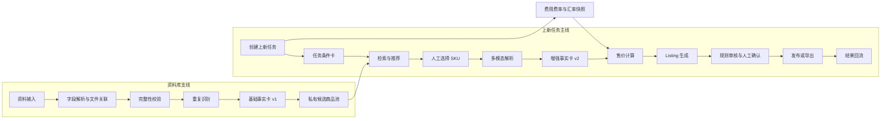
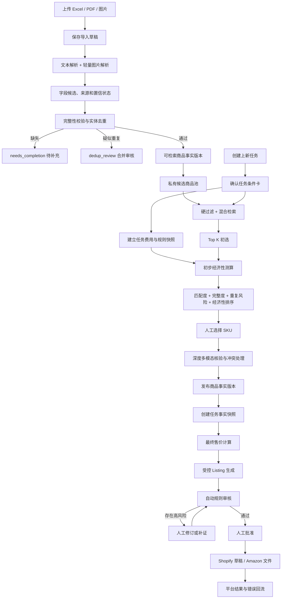
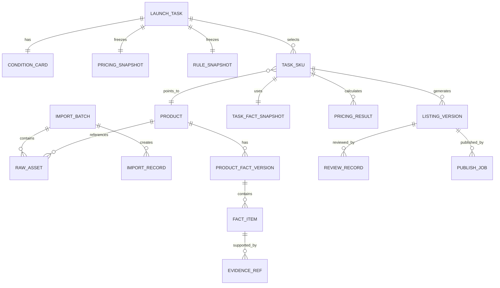

# 棱镜上新 PrismLaunch｜项目流程梳理与优化建议

> 分析对象：`棱镜上新_PrismLaunch_项目书.md`、`01_业务流程图.html`、`02_技术路线图.html` 及对应图片。  
> 本文只梳理流程，不替代原项目书。

## 1. 先说结论

棱镜上新的业务本质可以压缩成一句话：

> 把国内供应商提供的零散商品资料，转化为经过事实确认、能够安全用于海外平台的商品发布包。

当前项目由两条流程组成：

1. **资料库支线**：持续接收商品资料，形成可复用的候选商品池；
2. **上新任务主线**：针对某个平台和某次上新要求，从候选池中选择 SKU，核验事实，生成并发布 Listing。

现有流程的总体方向成立，但存在三个关键断点：

1. 智能推荐发生在图片解析之前，却使用了颜色、杯盖、款式等可能只能从图片得到的信息；
2. 最低利润在推荐完成后才计算，因此不能真正参与“哪个商品值得上架”的判断；
3. v2 事实卡既被描述为商品的可复用事实版本，又被绑定到单个上新任务，数据归属不清楚。

建议保留“两条流程、一个候选池”的基本结构，但重新定义事实版本、任务快照和各阶段放行条件。

---

## 2. 当前项目流程还原

### 2.1 总览



### 2.2 资料库支线

资料库支线不属于某一个上新任务，可以持续运行。

| 环节 | 输入 | 系统动作 | 输出 | 不通过时 |
|---|---|---|---|---|
| 1. 资料输入 | Excel/CSV、图片、包装图、规格 PDF | 创建导入批次，保存原始文件 | 原始资料及文件索引 | 文件错误时保留失败日志 |
| 2. 文件关联 | SKU、文件名、表格行、人工选择 | 将表格、图片和 PDF 关联到商品 | SKU—资料关系 | 无法关联时进入待处理区 |
| 3. 字段解析 | 表格和 PDF | 提取名称、类目、成本、重量、尺寸等候选字段 | 字段候选及来源 | 低置信度字段等待人工确认 |
| 4. 完整性校验 | 字段候选 | 检查候选池要求的必要字段 | 完整性结果 | 缺失字段进入待补充状态 |
| 5. 重复识别 | SKU、条码、标题、属性和资源指纹 | 区分新商品、完全重复、疑似重复 | 去重结果 | 疑似重复进入人工合并审核 |
| 6. 形成 v1 | 已确认的基础资料 | 保存基础事实和原始来源 | 基础商品事实卡 v1 | 未达到放行标准时不进入候选池 |
| 7. 候选池维护 | v1 商品摘要 | 建立关键词和语义检索索引 | 私有候选商品池 | 重复或已停用商品不参与检索 |

当前设计中，v1 的定位是：

- 保存商品表和规格资料中已经确认的基础事实；
- 保存图片、PDF 等原始资源的引用；
- 支持关键词检索、语义检索和条件筛选；
- 不包含图片识别结论；
- 不能直接作为最终 Listing 的全部事实来源。

### 2.3 上新任务主线

上新任务主线从一次具体的运营需求开始。

| 环节 | 输入 | 系统动作 | 输出 | 人工动作 |
|---|---|---|---|---|
| 1. 创建任务 | 平台、国家、一级类目、最低利润、补充要求 | 创建任务编号 | 上新任务 | 确认固定条件 |
| 2. 任务结构化 | 固定条件、自然语言补充 | 大模型抽取必须项、偏好项、排除项 | 可编辑任务条件卡 | 检查模型是否理解正确 |
| 3. 费用快照 | 平台、国家、时间 | 冻结汇率、费用配置和税费口径版本 | 任务价格快照 | 查看来源与时间 |
| 4. 检索与推荐 | 条件卡、v1 候选池 | 硬过滤、BM25、向量检索、融合、重排、规则过滤 | Top N 推荐结果 | 查看理由并选择 SKU |
| 5. 多模态解析 | v1、图片、包装图、PDF | OCR、视觉识别、图片—资料比对 | 多模态字段候选 | 处理冲突和低置信度结果 |
| 6. 形成 v2 | v1、多模态结果、人工确认 | 版本化合并事实和证据 | 增强事实卡 v2 | 确认 Listing 可用范围 |
| 7. 售价计算 | 成本事实、重量尺寸、费用快照、最低利润 | 计算费用构成和建议售价 | 建议售价及计算版本 | 修改或确认售价 |
| 8. Listing 生成 | 允许公开的事实、平台规则、售价 | 生成标题、卖点、描述和结构化字段 | Listing 草稿 | 修改文案 |
| 9. 规则审核 | Listing、事实来源、授权状态 | 检查缺失字段、风险词、无证据声明和平台格式 | 审核问题清单 | 关闭高风险项并批准 |
| 10. 发布 | 审核通过的草稿 | 创建 Shopify 草稿或导出 Amazon 文件 | 发布任务 | 决定是否正式提交 |
| 11. 结果回流 | 平台响应、错误码、人工修改 | 保存发布结果和版本 | 审计记录、修复任务 | 按错误修改后重试 |

---

## 3. 当前流程中的具体断点

### 3.1 推荐阶段拿不到它声称使用的全部属性

当前 v1 不识别图片，但推荐示例使用了“黑色”“无吸管”“保温结构”“简约通勤风”等属性。这些字段如果没有写在 Excel 或 PDF 中，必须等到多模态解析后才能得到。

因此，当前流程可能出现：

```text
推荐模块需要颜色和杯盖信息
        ↓
v1 中没有这些字段
        ↓
系统仍然输出“无吸管、黑色”的推荐理由
        ↓
推荐理由实际上没有事实来源
```

处理方式有两种：

1. 在资料入库阶段做一次轻量图片解析，使可检索事实完整；
2. 保持现有顺序，但推荐阶段只能使用 v1 中明确存在的字段，图片属性一律标记为未知。

推荐采用第一种，因为“颜色、款式、可见配件”本身就是选品时经常使用的条件。

### 3.2 “不能保存”使资料补全流程无法成立

原方案说资料未补齐时不能保存，同时又设计了 `needs_completion` 状态。两者冲突。

合理状态应该是：

```text
导入记录可以保存
        ↓
资料不完整时保存为 staging / needs_completion
        ↓
不能进入候选池、定价或发布
        ↓
补齐后重新校验并放行
```

也就是说，应该阻止“进入下一业务阶段”，而不是阻止“保存资料”。

### 3.3 最低利润没有参与选品

当前最低利润只用于选中 SKU 后反算建议售价。这意味着任何商品都可以通过提高售价满足最低利润要求，系统无法判断该售价是否有市场竞争力。

如果项目继续使用“智能选品”这一表述，推荐前至少要有一轮初步经济性筛选：

```text
候选商品成本
+ 初步物流和平台费用
+ 最低利润
        ↓
得到最低可行售价
        ↓
与运营给出的目标售价上限或市场参考区间比较
```

没有市场价格数据时，应将功能名称改为“候选商品匹配”，不要把属性匹配描述成商业选品。

### 3.4 v2 的数据归属不清楚

颜色、容量、包装文字等多模态结果属于商品本身，理论上应该跨任务复用；平台允许哪些事实进入 Listing，才属于具体任务。

建议拆成：

| 对象 | 归属 | 内容 |
|---|---|---|
| 商品事实版本 | SKU 全局 | 原始事实、图片解析、冲突、人工确认记录 |
| 任务事实快照 | 任务 + SKU | 本任务引用的事实版本、平台可用范围、规则版本 |
| Listing 版本 | 任务 + SKU + 平台 | 具体文案、售价、审核和发布结果 |

这样，同一 SKU 第二次进入新任务时不需要重复识别图片，只需建立新的任务事实快照。

### 3.5 定价依赖和事实版本没有统一

项目书一处说售价读取 v2，JSON 示例却写 `fact-card-v1`。实际上定价不应该机械依赖某个卡片版本，而应该依赖一组“已确认的定价事实”：

- 供货成本及币种；
- 包装重量和尺寸；
- 履约方式；
- 物流路线或模板；
- 原产国；
- 税则候选及确认状态；
- 当前任务的费用快照。

如果上述事实已经在 v1 确认，就不必等待图片解析；如果存在冲突，则应暂停最终定价。

### 3.6 当前定价不能严格称为净利润

MVP 不计算广告、退货、售后、长期仓储和部分交易费用，因此输出应叫：

> 在当前已纳入成本口径下的预计单件贡献利润。

否则用户可能把不完整估算误认为真实净利润。

### 3.7 申报价值与税则归类不应被普通商品流程自动确认

申报价值不应作为普通营销信息。税则编码也不能仅凭模型置信度自动变成确定结论。

建议流程为：

```text
系统生成税则候选和依据
        ↓
低风险演示中仅用于费用区间估算
        ↓
正式发布或清关前由运营/专业人员确认
```

### 3.8 一个 SKU 的“事实确认”与“平台合规”混在一起

商品事实解决的是“这件商品是什么”；平台规则解决的是“这个事实能否在当前平台、当前类目这样表达”。两者应该分开。

例如：

- “杯体为 304 不锈钢”可能是已经确认的事实；
- 但能否写入标题、五点或特定属性字段，要由平台规则决定；
- “可见杯盖”是视觉事实；
- “100% 防漏”是性能声明，必须有测试证据，不能由视觉事实推出。

---

## 4. 建议采用的目标流程

### 4.1 建议版端到端流程



### 4.2 调整后的关键变化

1. **先保存草稿，再决定能否放行**，不再因缺字段导致资料无法保存；
2. **入库阶段做轻量图片解析**，保证智能匹配可使用颜色、款式和可见配件；
3. **推荐前增加初步经济性测算**，最低利润不再只是事后抬高售价；
4. **商品事实版本全局复用**，任务只冻结所引用的事实、费用和规则版本；
5. **深度核验只针对 Top K 或人工选中的 SKU**，控制多模态调用成本；
6. **事实确认、平台合规和人工发布批准分成三个独立闸门**；
7. **发布结果回流到 Listing 和任务，不直接改写商品事实**。

---

## 5. 建议的数据对象关系



### 5.1 核心对象说明

| 对象 | 解决的问题 | 是否跨任务复用 |
|---|---|---|
| ImportBatch | 一次导入发生了什么 | 是 |
| RawAsset | 原始 Excel、PDF、图片在哪里 | 是 |
| Product | SKU 或商品实体是谁 | 是 |
| ProductFactVersion | 某一时刻已确认的商品事实 | 是 |
| FactItem | 单个字段的值、状态和来源 | 是 |
| LaunchTask | 本次要给哪个平台上什么商品 | 否 |
| ConditionCard | 本次筛选条件是什么 | 否 |
| PricingSnapshot | 本次采用哪一版汇率和费用 | 否 |
| RuleSnapshot | 本次采用哪一版平台规则 | 否 |
| TaskFactSnapshot | 本次 Listing 具体引用哪版事实 | 否 |
| ListingVersion | 每次生成或人工修改后的文案 | 否 |
| ReviewRecord | 谁审核了什么、为什么通过或拦截 | 否 |
| PublishJob | 向平台提交了什么、结果是什么 | 否 |

---

## 6. 建议的状态机

### 6.1 商品资料状态

```text
staging
  ├─→ needs_completion
  ├─→ dedup_review
  ├─→ parse_failed
  └─→ search_ready

search_ready
  ├─→ deep_fact_review
  ├─→ inactive
  └─→ merged

deep_fact_review
  ├─→ conflict_pending
  └─→ listing_ready
```

状态含义：

| 状态 | 含义 | 允许的操作 |
|---|---|---|
| `staging` | 已保存但尚未完成校验 | 编辑、补资料、重新解析 |
| `needs_completion` | 缺少进入候选池所需字段 | 编辑、补资料 |
| `dedup_review` | 与已有商品疑似重复 | 人工合并或确认新商品 |
| `search_ready` | 可参与任务检索 | 检索、推荐、继续补资料 |
| `deep_fact_review` | 已被选中，正在深度核验 | 处理证据和冲突 |
| `conflict_pending` | 存在未解决事实冲突 | 人工确认，不能生成最终 Listing |
| `listing_ready` | 当前事实版本可用于受控生成 | 创建任务事实快照 |

### 6.2 上新任务状态

```text
draft
→ condition_confirmed
→ retrieving
→ candidate_selected
→ fact_review
→ pricing_review
→ listing_draft
→ compliance_review
→ approved
→ publishing
→ published / publish_failed
```

每个状态都应记录：

- 进入时间；
- 操作人或系统模块；
- 使用的输入版本；
- 产生的输出版本；
- 失败原因；
- 下一步允许的动作。

---

## 7. 三个必须保留的人工确认点

### 确认点一：任务条件确认

大模型只能把自然语言整理为条件卡，用户必须确认模型没有误解类目、必须项和排除项。

### 确认点二：商品事实发布

涉及以下内容时必须人工确认：

- 多来源冲突；
- 品牌和授权；
- 304 等具体材料牌号；
- 配件数量；
- 性能、认证、安全声明；
- 税则候选和正式申报相关信息。

### 确认点三：正式发布批准

自动规则通过不等于允许系统直接发布。最终批准应同时冻结：

- 商品事实版本；
- Listing 版本；
- 建议售价或人工售价；
- 平台规则版本；
- 审核人和批准时间。

---

## 8. 推荐的 MVP 流程

当前完整方案横跨资料管理、选品、定价、税则、生成、审核和双平台发布，开发及演示范围过大。建议 MVP 只证明最核心的事实闭环。

### 8.1 MVP 保留

1. 导入 10 条商品记录及其图片/PDF；
2. 允许保存缺失资料草稿；
3. 展示 1 条缺失、1 条重复、1 条冲突，其余进入候选池；
4. 创建一个 Amazon US 单类目任务；
5. 根据确认字段完成候选匹配；
6. 选择一个 SKU，完成深度图片/PDF 核验；
7. 生成一张带字段状态和证据定位的商品事实卡；
8. 生成 Amazon 标题、五点和属性字段；
9. 拦截无依据的防漏、保温和认证声明；
10. 人工批准后导出可复核上传文件。

### 8.2 MVP 暂缓

- Shopify 发布；
- 自动 HTSUS 最终归类；
- 复杂进口税费；
- 全量市场选品；
- 自动把最低利润当成选品依据；
- 多类目通用规则；
- 无人值守自动发布。

上述内容可以保留在产品路线图中，但不应成为首个闭环的交付前提。

---

## 9. 建议的演示脚本

### 第一幕：资料不是天然可用的

导入 10 条商品记录，现场展示：

- 一条缺少包装尺寸，保存为 `needs_completion`；
- 一条与现有商品完全重复，被拦截；
- 一条图片颜色与表格颜色冲突；
- 其余记录进入候选池。

### 第二幕：任务条件不是直接交给模型执行

创建 Amazon US 饮具任务，输入固定条件和一句补充要求。系统生成条件卡，运营人员确认后开始匹配。

### 第三幕：推荐理由必须有来源

展示 Top 3，每一个匹配点都能打开对应事实来源；未知属性显示“未确认”，不生成貌似确定的理由。

### 第四幕：选择一个 SKU 后做深度核验

展示容量、颜色、杯盖、包装文字等解析结果，并主动暴露一个冲突。人工处理后发布新的商品事实版本。

### 第五幕：证明模型不能越过证据边界

生成 Listing 时故意要求加入“100% 防漏、保冷 24 小时、BPA-Free”，系统因为缺少证据而拒绝写入。

### 第六幕：审核和导出

展示文案—事实引用关系、人工批准、Amazon 文件导出和版本审计记录。

这个演示比同时展示 11 个页面更容易让观众记住核心价值：

> 不是让 AI 写得更多，而是让没有证据的话不能被写出去。

---

## 10. 流程验收指标

功能“能够运行”不等于流程有效，建议至少记录以下指标：

| 流程阶段 | 指标 |
|---|---|
| 资料解析 | 核心字段准确率、字段来源定位准确率 |
| 文件关联 | SKU—图片/PDF 关联准确率 |
| 重复识别 | 完全重复准确率、疑似重复误报率 |
| 条件结构化 | 固定条件保留率、必须项/排除项识别准确率 |
| 推荐 | Top 3 条件满足率、推荐理由有证据比例 |
| 多模态核验 | 可见属性准确率、冲突检出率 |
| 受控生成 | 无证据声明漏出率、事实引用覆盖率 |
| 人工审核 | 首次通过率、平均修改字段数 |
| 效率 | 人工流程耗时与系统流程耗时对比 |
| 发布 | 上传文件校验通过率、重复发布率 |

最关键的三项建议设为：

1. 高风险无证据声明漏出率为 0；
2. Listing 中客观事实的来源覆盖率为 100%；
3. 所有正式发布记录都能追溯到事实版本、规则版本和审核人。

---

## 11. 最终建议

现有项目不需要推翻，应该做的是把流程的核心对象和放行条件重新切清楚：

```text
原始资料
→ 可保存的导入草稿
→ 可检索商品事实
→ 任务条件与候选匹配
→ 商品深度核验
→ 任务事实快照
→ 售价与 Listing
→ 自动规则审核
→ 人工批准
→ 发布与结果回流
```

其中最重要的边界是：

- 资料缺失可以保存，但不能越级放行；
- 推荐只能使用当时已经存在的事实；
- 商品事实跨任务复用，任务只冻结引用版本；
- 经济性要在推荐阶段进行初筛，不能只在推荐后反算售价；
- 平台规则不能改变商品事实，只能决定事实如何表达；
- 自动审核通过后仍需人工批准正式发布。
